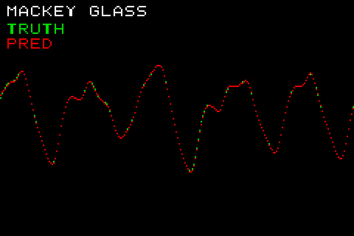

# GBA Echo State Network demo (Mackey-Glass)

Runs a reservoir-computing (ESN) one-step predictor on the Game Boy Advance and
plots it, mirroring the reference `esn-on-gba` project — but built end-to-end
through **rclite's** GBA target instead of the Rust `gba` crate.



The GBA renders (Mode 3, 240×160 bitmap):

- `MACKEY GLASS` title (white)
- the ground-truth series in **green**
- the ESN's one-step prediction in **red**

Because the prediction tracks the truth almost perfectly, the red curve sits on
top of the green almost everywhere; green only peeks through where they differ
(mostly the initial wash-out transient).

## How it works

`build.py` does everything:

1. **Train** — generates a Mackey-Glass series and trains a dense-readout ESN
   with rclite (SCR reservoir, N=64, leak 0.3, ridge readout over
   `[bias, input, state]`).
2. **Quantize** — affine **i16** quantization with a LUT `tanh`. This keeps the
   kernel pure-integer (no soft-float) so it runs fast on the 16.78 MHz ARM7TDMI,
   while staying essentially as accurate as f32 (one-step RMSE ≈ 0.0036 vs 0.0017).
3. **Cross-compile** — emits the reservoir kernel for `thumbv4t-none-eabi`
   (arm7tdmi) via rclite's GBA target, links it with the Mode-3 plotting
   front-end (`main.c`) and the GBA crt0/linker script into `build/esn_demo.gba`.
4. **Verify** — runs the cartridge in mGBA (headless, SDL dummy driver), and
   reconstructs `screen.png` from the framebuffer the GBA streams back over
   mGBA's debug log — a faithful screenshot of exactly what the GBA drew.

```sh
python examples/gba_esn_demo/build.py
```

Outputs `build/esn_demo.gba` (load it in any GBA emulator / flash cart) and
`screen.png`.

## Notes

- **Why SCR + i16 instead of the reference's dense f32?** A dense `f32` reservoir
  uses libm `tanhf` soft-float and O(N²) MACs — on a real GBA / full-speed mGBA
  that runs fine (≈seconds), but in this repo's *headless* mGBA test environment
  the emulator resets the console on very long uninterrupted compute bursts. The
  SCR (O(N)) + integer i16 + LUT-`tanh` path is ~orders of magnitude lighter,
  completes comfortably, and predicts Mackey-Glass just as well. To build the
  faithful dense-f32 variant, switch `Topology.SCR`→`Topology.ESN_STANDARD` and
  use the f32 kernel (`cross_compile_rc(..., dtype="f32")`); it produces a valid
  `.gba` that runs on real hardware.
- The GBA crt0 enables and services the VBlank interrupt (like a real GBA
  program) and sets WAITCNT for fast ROM access — see
  `rclite/targets/gba/support/crt0.s`.
