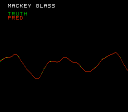

# NES Echo State Network demo

Runs an rclite Echo State Network on the **Nintendo Entertainment System**
(MOS 6502, NROM mapper) via the [llvm-mos](https://github.com/llvm-mos/llvm-mos-sdk)
toolchain, and screenshots the console plotting its own prediction — the NES
counterpart of the GBA demo's framebuffer grab.



The 6502 has no FPU and no hardware multiply — so the model is
**affine-quantized to integers** with a **structured (SCR) topology** (the
dense `W_res` matrix is never materialised). State buffers live in RAM; the
`const` weight / LUT tables land in PRG-ROM. This is the same "small-and-integer"
recipe the Arduino Uno target uses.

This demo uses **i16** storage: it lands near the float model (one-step RMSE
~0.005 vs ~0.002), whereas i8 here costs ~37× the RMSE to visible quantization
noise. The i16 state buffers are still only ~0.2 KB, trivial in the NES's 2 KB
of RAM (the weights sit in PRG-ROM regardless). The target also supports i8 for
the tightest models.

## Build & run

```sh
python examples/nes_esn_demo/build.py
```

What it does:

1. Trains an SCR ESN on Mackey-Glass (one-step-ahead) and affine-quantizes it
   to i16 with a 64-entry linear-interp tanh LUT.
2. Emits the integer kernel (`build/rc_kernel.c`) and the eval data
   (`build/esn_data.h`), then links them with the plotting front-end
   (`main.c`) into `build/rc.nes` using `mos-nes-nrom-clang` + neslib.
3. Runs the ROM in FCEUX and saves `screen.png` — the NES, on boot, runs the
   kernel on the embedded inputs and plots the ground **truth** (green) against
   its **prediction** (red), with the labels `MACKEY GLASS` / `TRUTH` / `PRED`,
   matching the GBA demo's layout. The red prediction is drawn on top, so it
   tracks the green truth closely (only small green slivers show where they
   differ — the i16 model is near-float accurate).

### How the NES renders it

The background addresses 256 distinct 8×8 tiles. Tiles 0–223 hold a 256×56 plot
band, drawn pixel-by-pixel into a framebuffer in the 8 KB of PRG-RAM at `$6000`
and streamed to **CHR-RAM** with rendering off; tiles 224+ hold the label
glyphs (font in `font.py`). One palette `[black, green, red, white]` colours
everything — a curve pixel is assigned plane 0 (green = truth) or plane 1
(red = pred), and the prediction is drawn last so it overwrites the truth where
they overlap (GBA framebuffer behaviour). Label glyphs are baked into the
matching plane(s); the white `MACKEY GLASS` title sets both.

The labels are drawn and rendering is enabled **before** the kernel runs, so
the screen shows content immediately; the plot fills in when the 6502 finishes
the integer kernel (tens of seconds at the NES's realtime clock — the build
screenshots it at emulator turbo). `int` is 16-bit on the 6502, so the
quant→row mapping is done in `long`.

## Prerequisites

- **llvm-mos SDK** — provides `mos-nes-nrom-clang` (+ bundled neslib). Put its
  `bin/` on `PATH`.
- **FCEUX** (for the screenshot) — `apt install fceux`, run under `xvfb-run`
  (FCEUX is a Qt app). Looked up as `fceux` or `/usr/games/fceux`. Saves the
  PNG via its Lua `gui.savescreenshotas`.

If `mos-nes-nrom-clang` is missing the script still trains and emits
`build/main.c` + `build/rc_kernel.c` + `build/esn_data.h`, then stops. The
generated `.nes` also runs on real hardware and any cycle-accurate emulator.

## See also

The **target itself** (`rclite/targets/nes/`) ships a separate, self-verifying
harness: `NesTarget.compile_affine_quantized(...)` embeds reference outputs and
checks them bit-for-bit on-device via the de-facto NES test protocol (blargg,
status + message at `$6000`), with `target.run(...)` reporting `TEST_PASS`
under Mesen's `--testrunner` or FCEUX. That path is exercised by the target
tests; this demo instead shows the visual, on-screen result.
